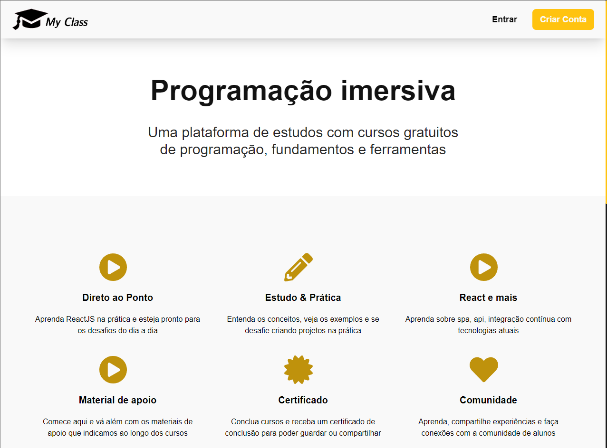
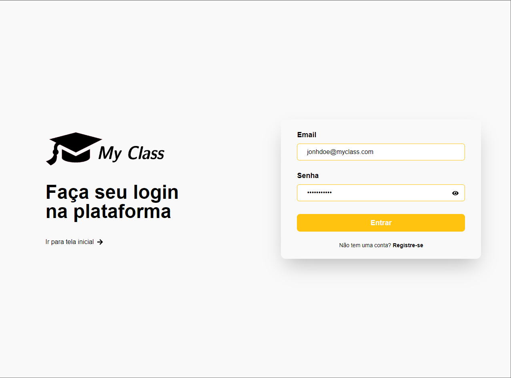
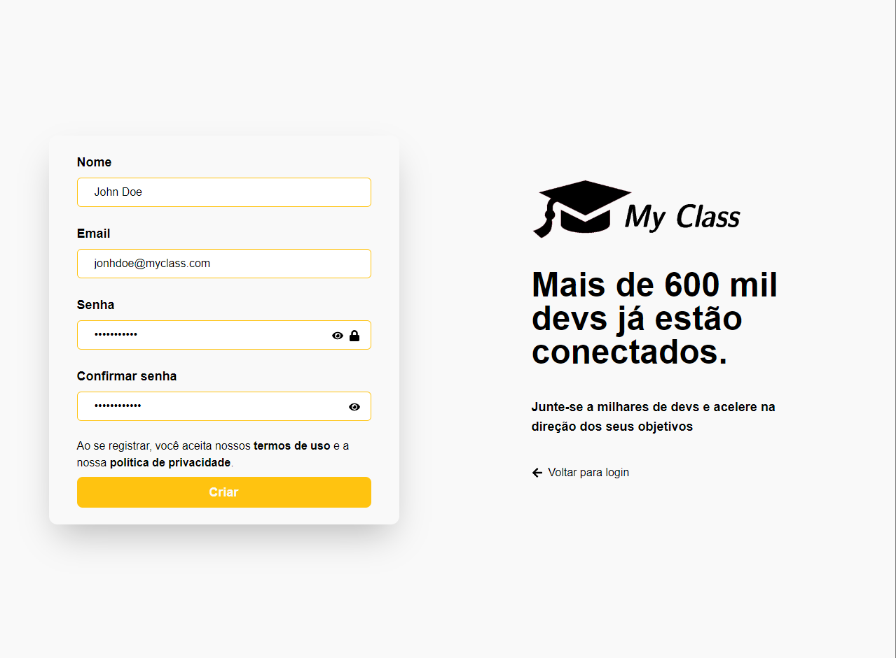
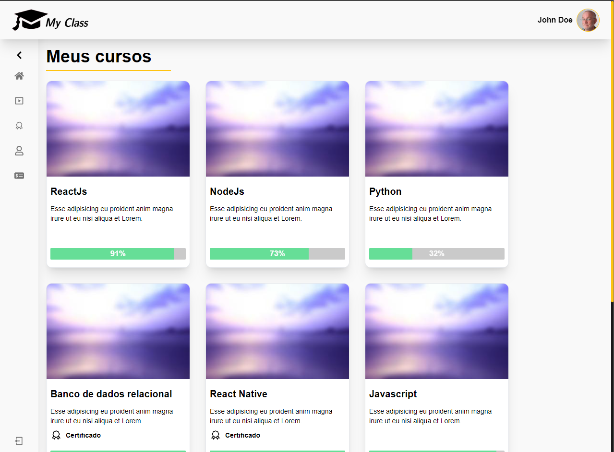
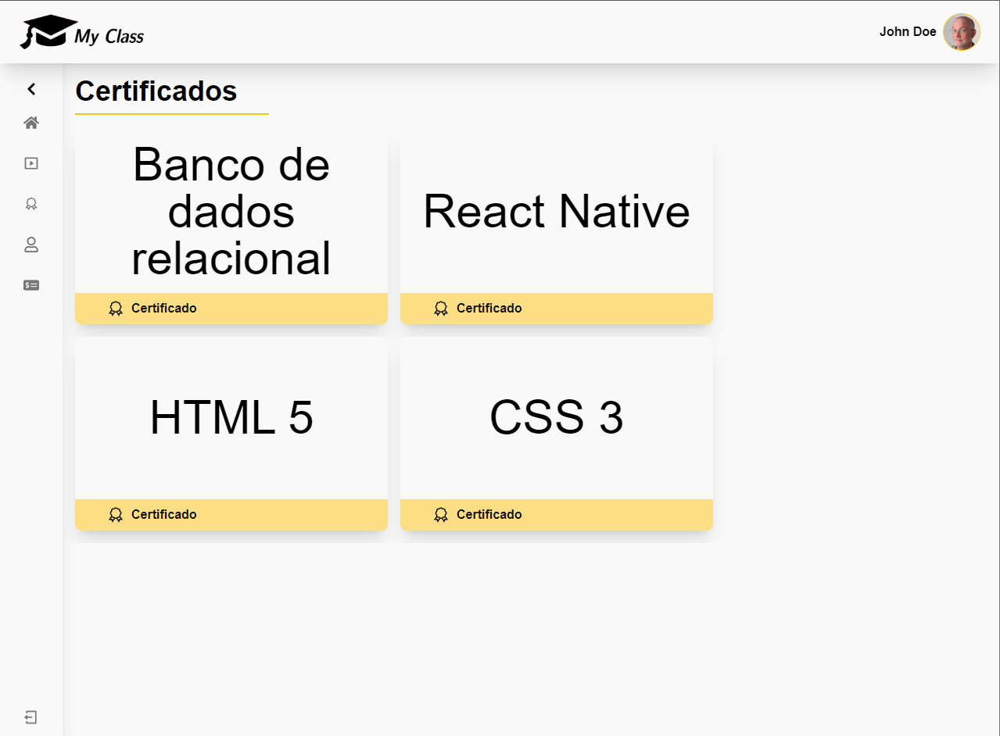
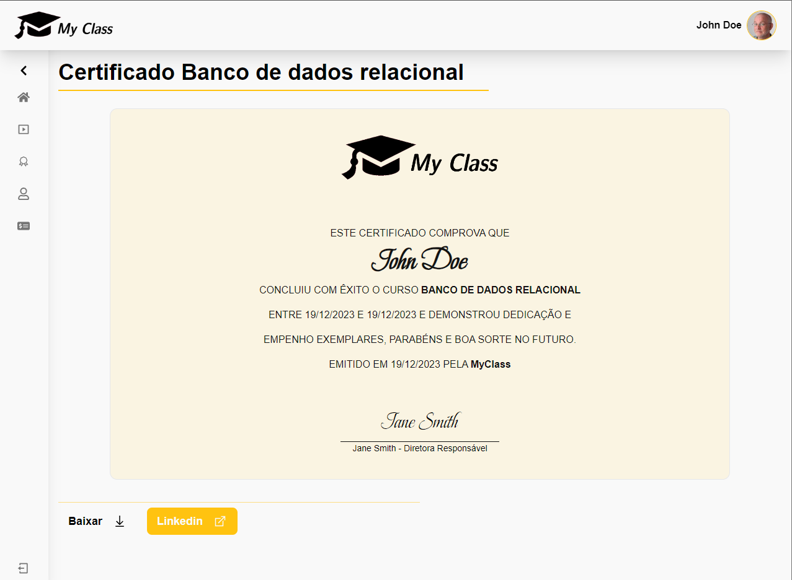
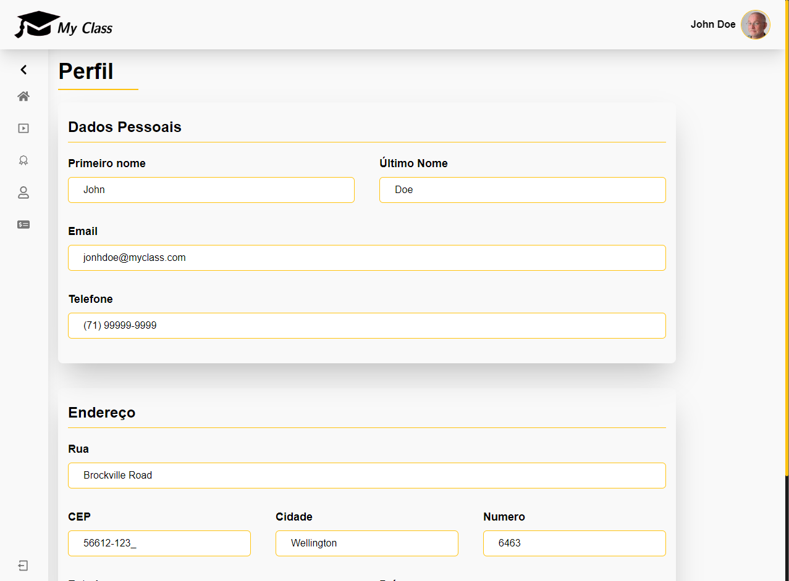

# My Class

[](<https://myclass-danilo-schleu.netlify.app/>)
[Clique na imagem para acessar o sistema](<https://myclass-danilo-schleu.netlify.app/>)

## Objetivo

O objetivo deste projeto é desenvolver um sistema de aula online sob demanda que permita aos professores disponibilizarem aulas de forma mais eficiente e interativa, e aos alunos aprender de forma mais eficaz.

## Paginas

  <details>
    <summary>Landing Page</summary>
    <a href="https://myclass-danilo-schleu.netlify.app">
      <figure>
        
      </figure>
    </a>
  </details>

  <details>
    <summary>Login</summary>
    <a href="https://myclass-danilo-schleu.netlify.app/class/signIn">
      <figure>
        
      </figure>
    </a>
  </details>

  <details>
    <summary>Cadastrar</summary>
    <a href="https://myclass-danilo-schleu.netlify.app/class/signUp">
      <figure>
        
      </figure>
    </a>
  </details>

  <details>
    <summary>Dashboard</summary>
    <a href="https://myclass-danilo-schleu.netlify.app/class/dashboard">
      <figure>
        
      </figure>
      </a>
  </details>

  <details>
    <summary>Cursos</summary>
    <a href="https://myclass-danilo-schleu.netlify.app/class/courses">
      <figure>
        
      </figure>
      </a>
  </details>

  <details>
    <summary>Certificados</summary>
    <a href="https://myclass-danilo-schleu.netlify.app/class/cerificates">
      <figure>
        
      </figure>
      <figure>
        
      </figure>
      </a>
  </details>

  <details>
    <summary>Perfil</summary>
    <a href="https://myclass-danilo-schleu.netlify.app/class/profile">
      <figure>
        
      </figure>
      </a>
  </details>

## Implementações futuras

- [ ] Editar dados perfil [salvar no localstorage]
- [ ] DarkMode
- [ ] Multi idiomas [i18n]
- [ ] Area do professor
- [ ] Validador de certificado

## Tecnologias utilizadas

- Linguagem de programação: TypeScript
- Framework web: React
- Framework css: Tailwind
- Compilador: Vite

## Instalação

> Para instalar o sistema, siga estas etapas:

- Clone o repositório:

```git
  git clone https://github.com/schleu/my-class
```

- Instale as dependências:

```cmd
cd my-class
yarn install
```

## Execução

> Para executar o sistema, execute o seguinte comando:

```cmd
yarn run start
```

O sistema será executado no endereço <http://localhost:5173>.

## Contribuições

Contribuições são bem-vindas. Para contribuir, siga estas etapas

1. Faça um fork do repositório.
2. Crie uma branch para sua contribuição.
3. Faça as alterações necessárias.
4. Faça o commit das alterações.
5. Envie um pull request.

## Licença

O sistema é licenciado sob a licença MIT.

## Mudanças no projeto sem banco de dados

- Os dados são armazenados em memória.
- Os dados são inicializados quando o sistema é iniciado.

```js
  src\moked
    courses.ts
    user.ts
```
